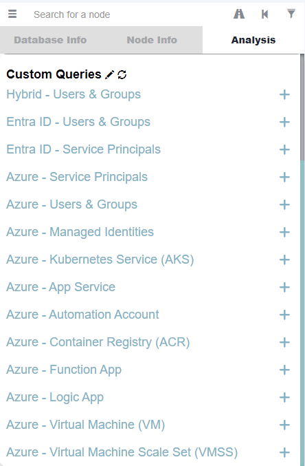
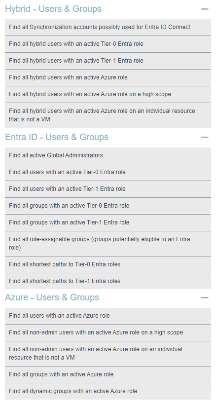
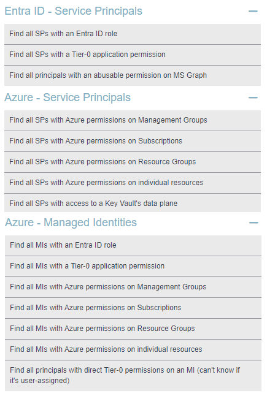

# AzureHound Queries

Collection of BloodHound queries for Microsoft Azure.

> "I just want to import Azure queries from this project to BloodHound 🤩" 
>
> 👉 <cite>[Click here](#bh-import)</cite>


## Objective

The objective of this project is to provide a scalable way to develop BloodHound queries for Azure.


## Background 

| Challenge | Solution in this project | 
|-----------|----------|
| BloodHound needs to use a single file to import custom queries, which is hard to scale for developing a large number of queries while keeping them categorized. | Queries are organized into dedicated files for development, and merged to a single BloodHound-ready file on push to the repository. |
| Complex queries often require the use of boolean operators to include multiple types of nodes and edges (e.g. nodes including all Tier-0 Entra roles). Such queries often end up being very long and hard to maintain when values need to be updated, especially accross multiple queries. | Queries are written in pseudo code using variables instead of long node or edge boolean strings. The content of such variables is maintained in a single place, and variables are populated on push to the repository. <br> This approach makes the inclusion or exclusion of nodes trivial and easy to scale accross multiple queries (e.g. excluding built-in service principals). |


## Project structure

| Asset | Type | Description |
|---|---|---|
| [.github/workflows](https://github.com/emiliensocchi/azurehound-queries/tree/main/.github/workflows) | Directory | Contains a Github Action executing the following on push to the repository: <br> 1. Populates variables used in pseudo code by queries located under [categories](https://github.com/emiliensocchi/azurehound-queries/tree/main/categories) (referred to as "categorized queries"). <br> 2. Merges all "categorized queries" with populated content to [customqueries.json](https://github.com/emiliensocchi/azurehound-queries/blob/main/customqueries.json). |
| [categories](https://github.com/emiliensocchi/azurehound-queries/tree/main/categories) | Directory | Contains "categorized queries" organized in dedicated files for each category. Those queries are written in pseudo code using [variables](https://github.com/emiliensocchi/azurehound-queries/tree/main/variables) for complex nodes and edges. |
| [variables](https://github.com/emiliensocchi/azurehound-queries/tree/main/variables) | Directory | Contains variable names and associated content, such as tiered roles and permissions. This is where content can be updated in a single place to populate variables used in different queries. |
| [customqueries.json](https://github.com/emiliensocchi/azurehound-queries/blob/main/customqueries.json) | File | BloodHound-ready file. Contains the latest version of all queries merged from different categories with populated variables. |


<a id='bh-import'></a>
## Importing merged queries to BloodHound 

### BloodHound Legacy

1. Copy [customqueries.json](https://github.com/emiliensocchi/azurehound-queries/releases/download/v1.0.0/customqueries.json) from the [latest release](https://github.com/emiliensocchi/azurehound-queries/releases) to the following location: 

```code
C:\Users\%USERNAME%\AppData\Roaming\bloodhound\customqueries.json
```

2. Within BloodHound, refresh "Custom Queries" in the analysis tab of the search panel.

### BloodHound Community Edition (CE)

Importing queries in bulk is currently not trivial in BloodHound CE (BHCE), but it can be achieved using the `/api/v2/saved-queries` endpoint of the BHCE API.

Here is a high-level example using curl:

```code
curl -X 'POST' \
  'http://localhost:8080/api/v2/saved-queries' \
  -H 'accept: application/json' \
  -H 'Content-Type: application/json' \
  -H 'Authorization: Bearer <TOKEN-VALUE>' \
  -d '{"name":"<QUERY-NAME>", "query":"<CYPHER-QUERY>"}'
```


## Screenshots

#### Overview of custom query categories once imported to BloodHound



#### Sample of Azure queries for users and groups




#### Sample of Azure queries for Service Principals and Managed Identities



#### Sample of Azure queries for Logic Apps


## Disclaimer

The tiering of roles and permissions used in this project is partly based on a personal tiering model, which does not necessarily comply with all companies. Depending on the reader's usage, those tiers may have to be adapated to the company in scope.
